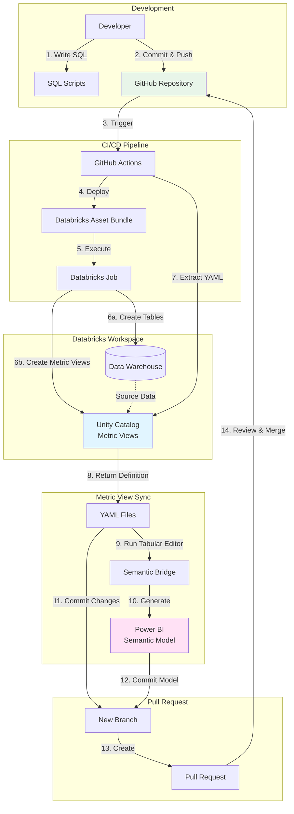

# Semantic Model Demo - Data Warehouse

> A complete solution for building a dimensional data warehouse with metric views and automated Power BI semantic model generation.

## Table of Contents
- [Overview](#overview)
- [Architecture](#architecture)
- [Quick Start](#quick-start)
- [Features](#features)
- [Project Structure](#project-structure)
- [Deployment](#deployment)
- [Documentation](#documentation)

## Overview

This repository demonstrates a modern data platform pattern:
- **Data Warehouse**: Star schema built on TPC-H dataset in Databricks Delta Lake
- **Metric Views**: Semantic layer in Unity Catalog for consistent business metrics
- **CI/CD**: GitHub Actions for automated deployment
- **BI Integration**: Automatic Power BI semantic model generation (work in progress)

**Catalog**: `demo` | **Schema**: `tpch_semantic`

## Architecture



## Workflow Explanation

### 1. **Development Phase**
- Define metric views in SQL (easy to write and maintain)
- Commit SQL scripts to `resources/sql_scripts/`

### 2. **Deployment Phase** (GitHub Actions: `deploy_databricks.yml`)
- Databricks Asset Bundle deploys notebooks and SQL scripts
- Job executes:
  - Creates data warehouse tables
  - Creates metric views in Unity Catalog

### 3. **Extraction Phase** (GitHub Actions: `sync_metric_view.yml`)
- Python script extracts metric view YAML from Unity Catalog
- YAML files saved to `resources/metric_views/`
- Tabular Editor Semantic Bridge generates Power BI semantic model

### 4. **Integration Phase**
- Automated PR created with:
  - Updated YAML definitions
  - Generated Power BI semantic model
- Review and merge to main

## Quick Start

### Option 1: Automated Deployment (Recommended)

1. **Configure GitHub Secrets** (see [CI/CD Setup Guide](CI_CD_SETUP.md))
2. **Create a Pull Request** → Validates configuration
3. **Merge to Main** → Automatically deploys and runs

### Option 2: Local Deployment

```bash
# Install Databricks CLI
curl -fsSL https://raw.githubusercontent.com/databricks/setup-cli/main/install.sh | sh

# Authenticate
databricks auth login --host https://your-workspace.cloud.databricks.com

# Deploy
databricks bundle deploy -t dev

# Run the job
databricks bundle run setup_datawarehouse_job -t dev
```

### Option 3: Manual Notebook Execution

### Python Notebook Approach
Use the **`setup_datawarehouse.py`** Databricks notebook for the easiest setup:

1. Upload `resources/notebooks/setup_datawarehouse.py` to Databricks
2. Run all cells (uses `demo.tpch_semantic` by default)
3. View results and sample queries

## Features

### Data Warehouse
- ✅ **Delta Lake**: ACID transactions, time travel, schema evolution
- ✅ **Star Schema**: Optimized for analytics queries
- ✅ **Surrogate Keys**: Auto-generated identity columns with `_id` suffix
- ✅ **Referential Integrity**: Primary and foreign key constraints
- ✅ **Parameterized**: Dynamic catalog/schema configuration

### CI/CD & Automation
- ✅ **Databricks Asset Bundles**: Infrastructure as code
- ✅ **GitHub Actions**: Automated validation and deployment
- ✅ **Metric View Extraction**: Sync Unity Catalog definitions to YAML
- ✅ **Job Orchestration**: Multi-task workflows with dependencies

### Semantic Layer (Metric Views)
- ✅ **Business Metrics**: Predefined calculations (revenue, orders, AOV)
- ✅ **Semantic Metadata**: Synonyms, formats, descriptions for AI/BI tools
- ✅ **Version 1.1 Spec**: Latest Databricks metric view features

## Project Structure

```
semantic_model_demo/
├── 📄 databricks.yml              # Bundle configuration
├── 📁 resources/
│   ├── 📁 jobs/
│   │   └── jobs.yml               # Job definitions
│   ├── 📁 notebooks/
│   │   └── setup_datawarehouse.py # Data warehouse creation
│   ├── 📁 sql_scripts/
│   │   ├── order_metrics.sql      # Metric view (detailed)
│   │   └── orders_aggregated.sql  # Metric view (aggregated)
│   └── 📁 metric_views/
│       └── order_metrics.yml      # YAML definitions
├── 📁 scripts/
│   └── extract_metric_views.py    # Extract from Unity Catalog
├── 📁 .github/workflows/
│   ├── validate_bundle.yml        # PR validation
│   ├── deploy_databricks.yml      # Deployment
│   └── sync_metric_view.yml       # Metric sync (WIP)
└── 📁 docs/
    ├── CI_CD_SETUP.md             # GitHub Actions guide
    └── DAB_DEPLOYMENT_GUIDE.md    # CLI deployment guide
```

## Data Model

### Star Schema
- **Fact**: `fact_order_line` - Order line items with measures
- **Dimensions**: Date, Customer, Part, Supplier, Order Header
- **Aggregate**: `orders_aggregated` - Pre-aggregated by year/quarter/region

### Metric Views
- **order_metrics_mv** - Detailed order line analytics
- **orders_aggregated_mv** - Summary metrics by time and geography

## Deployment

### Via GitHub Actions (CI/CD)
1. Set up [GitHub Secrets](CI_CD_SETUP.md#required-github-secrets)
2. Create PR → Auto-validates
3. Merge to main → Auto-deploys

### Via Databricks CLI
```bash
databricks bundle deploy -t dev
databricks bundle run setup_datawarehouse_job -t dev
```

### Manual in Databricks
Upload and run `resources/notebooks/setup_datawarehouse.py`

## Documentation

| Document | Description |
|----------|-------------|
| [CI/CD Setup Guide](CI_CD_SETUP.md) | GitHub Actions configuration, secrets, and workflows |

## Local Development

### Install Databricks CLI

**Linux/macOS**:
```bash
curl -fsSL https://raw.githubusercontent.com/databricks/setup-cli/main/install.sh | sh
```

**Windows (PowerShell)**:
```powershell
iwr https://raw.githubusercontent.com/databricks/setup-cli/main/install.ps1 | iex
```

### Deploy Locally

```bash
# Authenticate
databricks auth login --host https://dbc-381633f5-fe84.cloud.databricks.com

# Validate and deploy
databricks bundle validate -t dev
databricks bundle deploy -t dev

# Run the job
databricks bundle run setup_datawarehouse_job -t dev
```

## Configuration

All configuration is in `databricks.yml`:
- **Catalog**: `demo`
- **Schema**: `tpch_semantic`
- **Targets**: `dev` and `prod`
- **SQL Warehouse ID**: Configure in variables section

## Contributing

See deployment guides for development workflow. All changes should go through pull requests for validation.

## License

MIT

### Key Metrics
- **Total Net Amount** - Net revenue after discounts
- **Total Gross Revenue** - Gross revenue including tax
- **Total Orders** - Count of distinct orders
- **Total Quantity** - Sum of items ordered
- **Average Order Value** - Calculated: Net Amount / Orders
- **Average Discount Rate** - Average discount percentage
- **Discount Percentage** - Calculated: Discount / Extended Amount

### Available Dimensions
- **Customer** - Name, Market Segment, Nation, Region
- **Ship Date** - Year, Quarter, Month, Date, Weekday, Is Weekend
- **Part** - Name, Brand, Type, Size, Container
- **Supplier** - Name, Nation, Region
- **Order Header** - Status, Priority, Clerk Name
- **Fact** - Order Header ID, Line Number, Ship Mode

### Querying the Metric View

Use the `MEASURE()` function to query metrics:

```sql
SELECT 
  `Customer Region`,
  `Ship Year`,
  MEASURE(`Total Net Amount`) as revenue,
  MEASURE(`Total Orders`) as orders,
  MEASURE(`Average Order Value`) as aov
FROM main.demo_tpch.order_metrics_mv
WHERE `Ship Year` = 1997
GROUP BY `Customer Region`, `Ship Year`
ORDER BY revenue DESC
```

## Technical Details

- **Source Data**: samples.tpch (Databricks sample dataset)
- **Storage Format**: Delta Lake
- **Surrogate Keys**: Auto-generated using IDENTITY columns
- **Key Naming Convention**: `{table_name}_id` for surrogate keys, `{table_name}_key` for business keys
- **Semantic Model**: YAML version 1.0 with tags and format support
