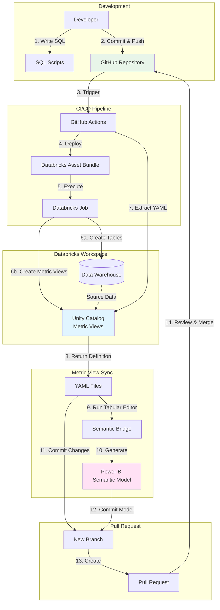

# Semantic Model Demo - Data Warehouse

This repository contains scripts to create a dimensional data warehouse model based on the TPC-H dataset, along with a semantic model definition for analytics and BI tools.

## Architecture Overview



## Workflow Explanation

### 1. **Development Phase**
- Define metric views in SQL (easy to write and maintain)
- Commit SQL scripts to `resources/sql_scripts/`

### 2. **Deployment Phase** (GitHub Actions: `deploy_databricks.yml`)
- Databricks Asset Bundle deploys notebooks and SQL scripts
- Job executes:
  - Creates data warehouse tables
  - Creates metric views in Unity Catalog

### 3. **Extraction Phase** (GitHub Actions: `sync_metric_view.yml`)
- Python script extracts metric view YAML from Unity Catalog
- YAML files saved to `resources/metric_views/`
- Tabular Editor Semantic Bridge generates Power BI semantic model

### 4. **Integration Phase**
- Automated PR created with:
  - Updated YAML definitions
  - Generated Power BI semantic model
- Review and merge to main

## Repository Contents

### Core Files
- **`databricks.yml`** - Databricks Asset Bundle configuration
- **`resources/notebooks/setup_datawarehouse.py`** - Data warehouse creation notebook
- **`resources/sql_scripts/`** - SQL scripts for metric view creation
- **`resources/jobs/jobs.yml`** - Job definitions for automated workflows
- **`scripts/extract_metric_views.py`** - Extracts YAML definitions from Unity Catalog

### CI/CD Workflows
- **`validate_bundle.yml`** - Validates DAB on pull requests
- **`deploy_databricks.yml`** - Deploys bundle and runs jobs after merge to main
- **`sync_metric_view.yml`** - Syncs metric views (currently disabled, work in progress)

## Quick Start (Recommended)

### Python Notebook Approach
Use the **`setup_datawarehouse.py`** Databricks notebook for the easiest setup:

1. Upload `setup_datawarehouse.py` to your Databricks workspace
2. The notebook uses parameters from the DAB job by default:
   - **Catalog**: `demo`
   - **Schema**: `tpch_semantic`
   - Can be overridden via notebook widgets or manual edits
3. Run all cells - the notebook will:
   - Create catalog and schema
   - Set the context automatically
   - Create all dimension and fact tables with surrogate keys
   - Populate all tables with data
   - Show verification queries

**Benefits**: Variables work across all commands, provides progress feedback, includes sample queries.

## Features

- ✅ Delta table format for ACID transactions
- ✅ Surrogate keys with `_id` suffix (auto-generated using IDENTITY)
- ✅ Primary key constraints on all tables
- ✅ Foreign key constraints on fact tables
- ✅ Dynamic catalog and schema configuration via Python
- ✅ Star schema design pattern

## Schema Design

### Dimension Tables
- **dim_date** - Date dimension with date_id surrogate key
- **dim_customer** - Customer dimension with customer_id surrogate key
- **dim_part** - Part dimension with part_id surrogate key
- **dim_supplier** - Supplier dimension with supplier_id surrogate key
- **dim_order_header** - Order header dimension with order_header_id surrogate key

### Fact Tables
```
fact_order_line
├── order_header_id (FK → dim_order_header)
├── customer_id (FK → dim_customer)
├── part_id (FK → dim_part)
├── supplier_id (FK → dim_supplier)
├── ship_date_id (FK → dim_date)
├── commit_date_id (FK → dim_date)
└── receipt_date_id (FK → dim_date)
```

## Semantic Model / Metric View

The **`semantic_model_v1.yml`** file defines a Databricks Metric View for consistent business metrics:

### Features (Version 1.1)
- ✅ **Semantic metadata** with `display_name`, `format`, and `synonyms` for AI/BI tools
- ✅ **Star schema joins** to all dimension tables
- ✅ **Measures** with aggregations (SUM, AVG, COUNT, COUNT DISTINCT)
- ✅ **Calculated metrics** using `MEASURE()` references (Average Order Value, Discount Percentage)
- ✅ **Dimensions** from fact and all joined dimension tables
- ✅ **Format strings** for currency ($#,##0.00), percentages (0.0%), and numbers (#,##0)

### Creating the Metric View

The metric view is **automatically created** when you run `setup_datawarehouse.py`! The notebook includes a cell that creates the metric view using SQL with embedded YAML:

```sql
CREATE OR REPLACE VIEW catalog.schema.order_metrics_mv
WITH METRICS
LANGUAGE YAML
COMMENT 'TPC-H Order Analytics Metric View'
AS $$
-- YAML definition embedded here
$$;
```

The YAML definition is embedded directly in the SQL, so no separate file upload is needed.

### Key Metrics
- **Total Net Amount** - Net revenue after discounts
- **Total Gross Revenue** - Gross revenue including tax
- **Total Orders** - Count of distinct orders
- **Total Quantity** - Sum of items ordered
- **Average Order Value** - Calculated: Net Amount / Orders
- **Average Discount Rate** - Average discount percentage
- **Discount Percentage** - Calculated: Discount / Extended Amount

### Available Dimensions
- **Customer** - Name, Market Segment, Nation, Region
- **Ship Date** - Year, Quarter, Month, Date, Weekday, Is Weekend
- **Part** - Name, Brand, Type, Size, Container
- **Supplier** - Name, Nation, Region
- **Order Header** - Status, Priority, Clerk Name
- **Fact** - Order Header ID, Line Number, Ship Mode

### Querying the Metric View

Use the `MEASURE()` function to query metrics:

```sql
SELECT 
  `Customer Region`,
  `Ship Year`,
  MEASURE(`Total Net Amount`) as revenue,
  MEASURE(`Total Orders`) as orders,
  MEASURE(`Average Order Value`) as aov
FROM main.demo_tpch.order_metrics_mv
WHERE `Ship Year` = 1997
GROUP BY `Customer Region`, `Ship Year`
ORDER BY revenue DESC
```

## Technical Details

- **Source Data**: samples.tpch (Databricks sample dataset)
- **Storage Format**: Delta Lake
- **Surrogate Keys**: Auto-generated using IDENTITY columns
- **Key Naming Convention**: `{table_name}_id` for surrogate keys, `{table_name}_key` for business keys
- **Semantic Model**: YAML version 1.0 with tags and format support
